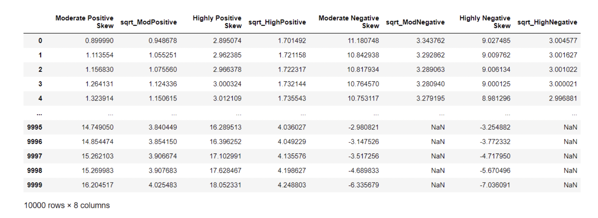
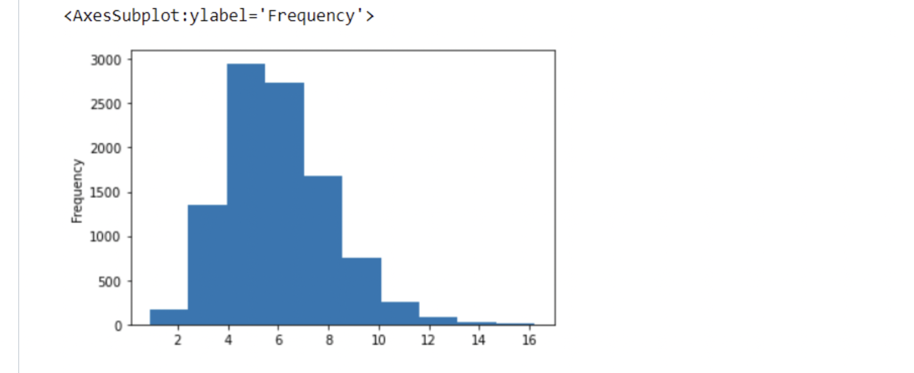
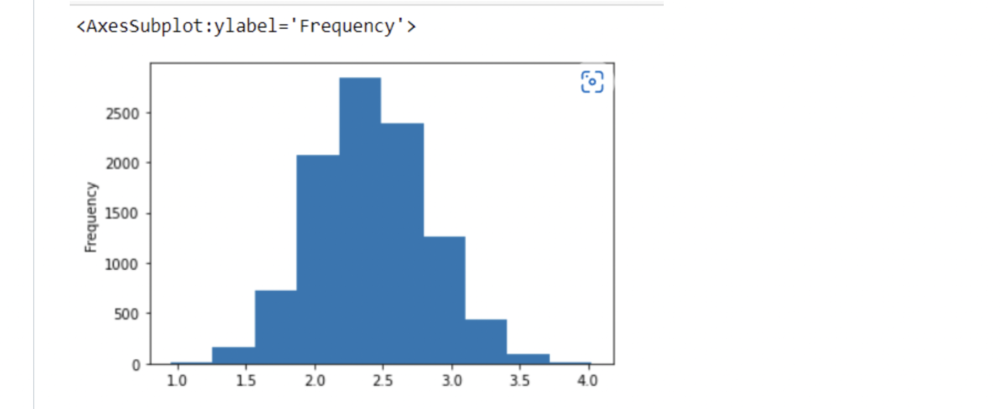
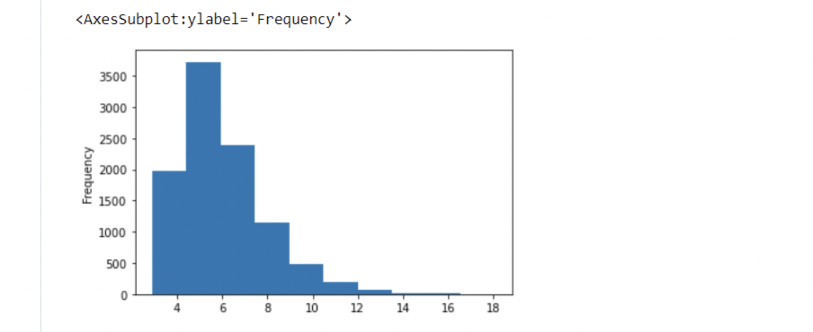
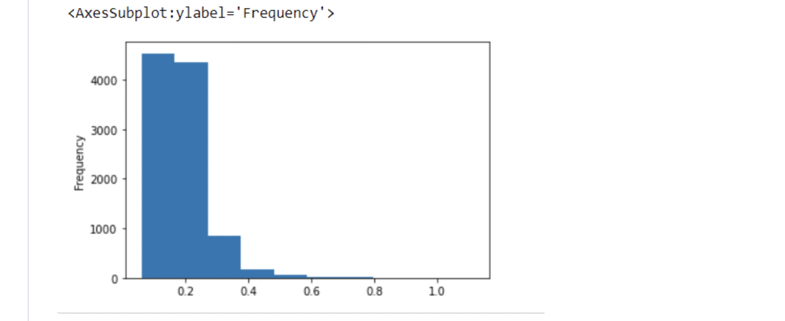
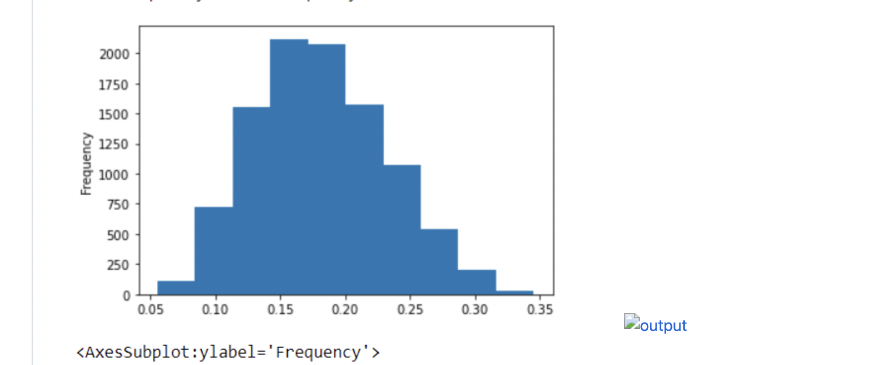

# EX-06-Feature-Transformation

## AIM
To Perform the various feature transformation techniques on a dataset and save the data to a file. 

# Explanation
Feature Transformation is a mathematical transformation in which we apply a mathematical formula to a particular column(feature) and transform the values which are useful for our further analysis.

 
# ALGORITHM
### STEP 1
Read the given Data
### STEP 2
Clean the Data Set using Data Cleaning Process
### STEP 3
Apply Feature Transformation techniques to all the feature of the data set
### STEP 4
Save the data to the file


# CODE
```import numpy as np
import pandas as pd
import seaborn as sns
import statsmodels.api as sm
import scipy.stats as stats
import matplotlib.pyplot as plt
df=pd.read_csv("Data_to_Transform.csv")
df
df1=df.copy()
log_ModPositive = np.log1p(df1["Moderate Positive Skew"])
log_HighPositive = np.log1p(df1["Highly Positive Skew"])
log_ModNegative = np.log1p(df1["Moderate Negative Skew"])
log_HighNegative = np.log1p(df1["Highly Negative Skew"])
df1.insert(1,"log_ModPositive",log_ModPositive)
df1.insert(3,"log_HighPositive",log_HighPositive)
df1.insert(5,"log_ModNegative",log_ModNegative)
df1.insert(7,"log_HighNegative",log_HighNegative)
df1
df1["Moderate Positive Skew"].plot(kind = 'hist')
df1["log_ModPositive"].plot(kind = 'hist')
df1["Highly Positive Skew"].plot(kind = 'hist')
df1["log_HighPositive"].plot(kind = 'hist')
df1["Moderate Negative Skew"].plot(kind = 'hist')
df1["log_ModNegative"].plot(kind = 'hist')
df1["Highly Negative Skew"].plot(kind = 'hist')
df1["log_HighNegative"].plot(kind = 'hist')
df2=df.copy()
sqrt_ModPositive = df["Moderate Positive Skew"]**(1/2)
sqrt_HighPositive = df["Highly Positive Skew"]**(1/2)
sqrt_ModNegative = df["Moderate Negative Skew"]**(1/2)
sqrt_HighNegative = df["Highly Negative Skew"]**(1/2)
df2.insert(1,"sqrt_ModPositive",sqrt_ModPositive)
df2.insert(3,"sqrt_HighPositive",sqrt_HighPositive)
df2.insert(5,"sqrt_ModNegative",sqrt_ModNegative)
df2.insert(7,"sqrt_HighNegative",sqrt_HighNegative)
df2
df2["Moderate Positive Skew"].plot(kind = 'hist')
df2["sqrt_ModPositive"].plot(kind = 'hist')
df2["Highly Positive Skew"].plot(kind = 'hist')
df2["sqrt_HighPositive"].plot(kind = 'hist')
df2["Moderate Negative Skew"].plot(kind = 'hist')
df2["sqrt_ModNegative"].plot(kind = 'hist')
df2["Highly Negative Skew"].plot(kind = 'hist')
df2["sqrt_HighNegative"].plot(kind = 'hist')
df3=df.copy()
reciprocal_ModPositive = 1/df["Moderate Positive Skew"]
reciprocal_HighPositive = 1/df["Highly Positive Skew"]
reciprocal_ModNegative = 1/df["Moderate Negative Skew"]
reciprocal_HighNegative = 1/df["Highly Negative Skew"]
df3.insert(1,"reciprocal_ModPositive",reciprocal_ModPositive)
df3.insert(3,"reciprocal_HighPositive",reciprocal_HighPositive)
df3.insert(5,"reciprocal_ModNegative",reciprocal_ModNegative)
df3.insert(7,"reciprocal_HighNegative",reciprocal_HighNegative)
df3
df3["reciprocal_ModPositive"].plot(kind = 'hist')
df3["reciprocal_HighPositive"].plot(kind = 'hist')
df3["reciprocal_ModNegative"].plot(kind = 'hist')
df3["reciprocal_HighNegative"].plot(kind = 'hist')
from scipy.stats import boxcox
df4=df.copy()
bcx_ModPositive, lam = boxcox(df["Moderate Positive Skew"])
bcx_HighPositive, lam = boxcox(df["Highly Positive Skew"])
df4.insert(1,"bcx_ModPositive",bcx_ModPositive)
df4.insert(3,"bcx_HighPositive",bcx_HighPositive)
df4
df4["bcx_ModPositive"].plot(kind = 'hist')
df4["bcx_HighPositive"].plot(kind = 'hist')
from scipy.stats import yeojohnson
df5=df.copy()
yf_ModPositive, lam = yeojohnson(df["Moderate Positive Skew"])
yf_HighPositive, lam = yeojohnson(df["Highly Negative Skew"])
yf_ModNegative, lam = yeojohnson(df["Moderate Negative Skew"])
yf_HighNegative, lam = yeojohnson(df["Highly Negative Skew"])
df5.insert(1,"yf_ModPositive",yf_ModPositive)
df5.insert(3,"yf_HighPositive",yf_HighPositive)
df5.insert(5,"yf_ModNegative",yf_ModNegative)
df5.insert(7,"yf_HighNegative",yf_HighNegative)
df5
df5["yf_ModPositive"].plot(kind = 'hist')
df5["yf_HighPositive"].plot(kind = 'hist')
df5["yf_ModNegative"].plot(kind = 'hist')
df5["yf_HighNegative"].plot(kind = 'hist')
```

# OUPUT












# Result
The various feature transformation techniques has been performed on the given datasets and the data are saved to a file.


